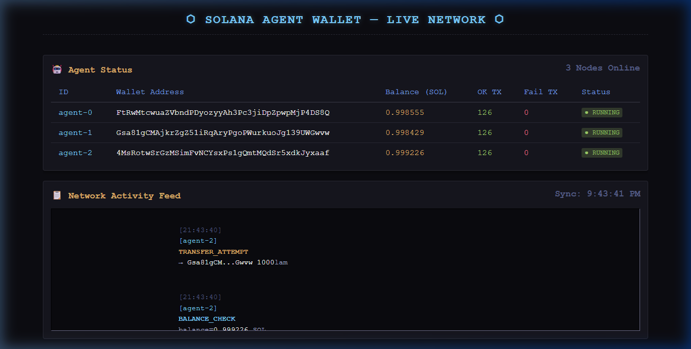

# solana-agent-wallet

An autonomous multi-agent system where each AI agent manages its own Solana wallet on Devnet. Agents are spun up simultaneously, perform autonomous SOL transfers between each other, and are monitored via a live CLI dashboard.

## Features

- 🔑 **Per-Agent Wallets**: Each agent generates a unique Solana Keypair on creation.
- 🔒 **Encrypted Key Storage**: Keys are stored in `keys.json` encrypted with AES-256-CBC using a password from `.env`.
- 🤖 **Autonomous Agents**: Each agent periodically sends small SOL transfers to its peers on a configurable timer.
- 📊 **Live CLI Dashboard**: A real-time terminal dashboard powered by `blessed` shows agent status, balances, and action logs.
- 📝 **Structured Logging**: All actions are logged with timestamp, agent ID, action type, and transaction signature.
- 🌐 **Solana Devnet**: All operations target Devnet for safe development and testing.

## Live Demo
> **[⬇️ Skip to Deep Dive: Wallet Architecture & Security](#deep-dive-architecture--security)**



## Project Structure

```
solana-agent-wallet/
├── src/
│   ├── wallet/
│   │   ├── WalletManager.ts        # Creates and manages agent keypairs
│   │   └── KeyStorage.ts           # Secure keypair storage (AES-256-CBC encrypted JSON)
│   ├── agent/
│   │   ├── Agent.ts                # Individual agent class with wallet + decision logic
│   │   └── AgentOrchestrator.ts    # Manages multiple agents simultaneously
│   ├── solana/
│   │   ├── connection.ts           # Devnet RPC connection
│   │   └── transactions.ts         # Transaction building and signing helpers
│   ├── dashboard/
│   │   └── Dashboard.ts            # CLI dashboard to observe agent actions live
│   └── index.ts                    # Entry point
├── tests/
│   └── agent.test.ts
├── SKILLS.md
├── README.md
├── .env.example
└── package.json
```

## Setup

### 1. Prerequisites

- Node.js v18+
- npm or yarn

### 2. Install Dependencies

```bash
npm install
```

### 3. Configure Environment

```bash
cp .env.example .env
# Edit .env and set a strong ENCRYPTION_PASSWORD
```

### 4. Fund Agent Wallets (Devnet)

After the first run, the agent public keys will be printed in the dashboard. Use the Solana CLI or a faucet to airdrop SOL:

```bash
solana airdrop 1 <AGENT_PUBLIC_KEY> --url devnet
# Or use: https://faucet.solana.com
```

## Usage

### Development (3 agents, 10 second interval)

```bash
npm run dev
```

### Custom configuration

```bash
npx ts-node src/index.ts --agents=5 --interval=15
```

### CLI Arguments

| Argument | Description | Default |
|---|---|---|
| `--agents=N` | Number of agents to spawn | `3` |
| `--interval=S` | Transfer interval in seconds | `10` |

## Deep Dive: Architecture & Security

This project was built specifically for the **DeFi Developer Challenge – Agentic Wallets for AI Agents** bounty. It fulfills all requirements for a secure, autonomous, multi-agent sandbox.

### 1. Wallet Design & Separation of Concerns
The system enforces a strict boundary between "Agent Logic" (the AI/brain making decisions) and "Wallet Operations" (key management and signatures):
- **`WalletManager`**: Purely responsible for cryptographic key generation and loading. It provides a `ManagedWallet` interface.
- **`Agent`**: The autonomous actor. It receives a `ManagedWallet` via dependency injection. The agent decides *when*, *who*, and *how much* to transfer, but routes the execution through the heavily abstracted Solana connection utilities.

### 2. Security Considerations & Key Management
AI agents run as persistent daemon processes, meaning their private keys must be accessible to the host machine without human prompting, yet secure at rest.
- **At Rest**: Agent private keys are **never** stored in plaintext. `KeyStorage.ts` uses Node's built-in `crypto` module to encrypt payloads using **AES-256-CBC**. The encryption password is derived via `scrypt` from an environment variable (`ENCRYPTION_PASSWORD`).
- **In Memory**: Keys are decrypted only at the exact moment the `AgentOrchestrator` initializes the agents into memory. 
- **Sandboxed Scope**: Agents only hold keys for their specific Devnet testing addresses. They are explicitly prevented from reading each other's secret keys.

### 3. Agent Autonomy & DeFi Interaction
The agents demonstrate autonomy by running on independent event loops (timers). The orchestrator handles peer discovery so agents know who is on the network.
- **SOL Transfers (`npm run dashboard`)**: Agents randomly select peers and autonomously sign and broadcast standard SOL transfers.
- **DeFi Protocol Interaction (`npm run spl-demo`)**: Shows programmatic protocol interaction. The system dynamically loads N wallets, programmatically launches a new SPL Token Mint, provisions Associated Token Accounts (ATAs), and executes dynamic SPL token distributions via autonomous signatures.

## Running Tests

```bash
npm test
```

## Tech Stack

| Package | Purpose |
|---|---|
| `@solana/web3.js` | Solana blockchain interactions |
| `bs58` | Keypair encoding/decoding |
| `crypto` (built-in) | AES-256-CBC encryption for stored keys |
| `blessed` | CLI dashboard UI |
| `cli-table3` | Formatted tables |
| `dotenv` | Environment variable management |
| `jest` + `ts-jest` | Testing framework |
| `typescript` | Strict mode TypeScript |

## Security Notes

- **Never commit your `.env` file.** It is already in `.gitignore`.
- The encryption password must be at least 32 characters for good security.
- `keys.json` is encrypted but should still be treated as sensitive. Do not commit it.
